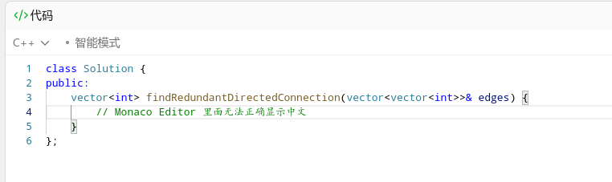
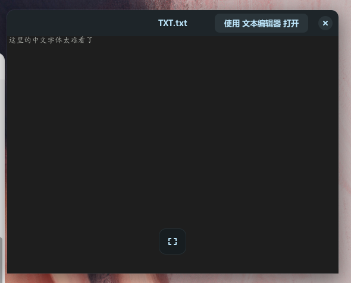
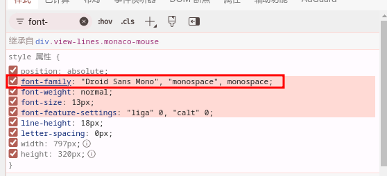
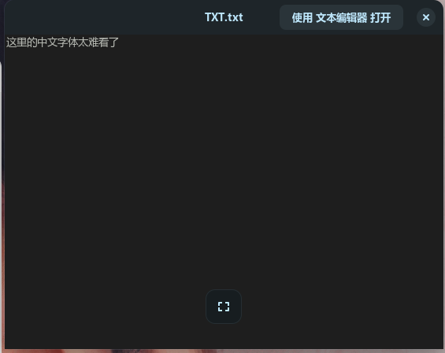
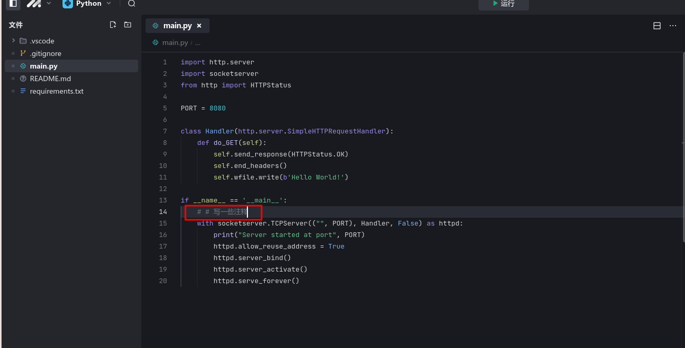

# BUG 解决记录

> 摘要: 重装新系统并安装好WinFonts后,发现一个很奇怪的现象,无论我怎么调整字体都无法让类似Leetcode这样的编辑器显示正确的中文字体,解决方案是配置fontconfig的后备字体配置文件, 问题解决

## 现象描述

重装新系统并安装好WinFonts后,发现一个很奇怪的现象,无论我怎么调整字体都无法让类似Leetcode这样的编辑器显示正确的中文字体. 检查了其他用Monaco编辑器的网站,发现都有这个问题



另可恶的是,这一现象在一些系统软件中也存在,比如自带的文本预览功能,真的太影响体验了



## 排查记录

### 检查元素

检查对应行的`font-family`属性发现, 以此使用三种字体: `"Droid Sans Mono"`, `"monospace"`, `monospace`, 依次删除判定当前哪个字体生效,最后发现删除`"monospace"`后,中文字体变化成微软雅黑,这和我设置的浏览器字体是一致的.



> 分析: 系统可能不存在名称为`"monospace"`的字体或者该字体的后备中文字体是楷体


## 基本解决方案

使用fontconfig的后备字体机制, 给`"monospace"`设置一个后备字体, 或许能解决问题

### 打开后备字体配置文件

文件`~/.config/fontconfig/fonts.conf`可用于后备字体的配置, 如果没有该文件, 可以创建一个, 初始内容可以如下:

```xml
<?xml version="1.0"?>
<!DOCTYPE fontconfig SYSTEM "urn:fontconfig:fonts.dtd">

<fontconfig>
</fontconfig>
```

### 增加一个新的`alias`子节点

增加一个新的`alias`子节点, 为`"monospace"`配置后备字体为`"Microsoft YaHei UI"`

```xml
<?xml version="1.0"?>
<!DOCTYPE fontconfig SYSTEM "urn:fontconfig:fonts.dtd">

<fontconfig>
    <alias>
        <!-- 你要设置后备字体的字体名称 -->
        <family>monospace</family>  
        <prefer>
            <!-- 要设置的后备字体列表 -->
            <family>Microsoft YaHei UI</family>
            <!-- 可以是多个 -->
        </prefer>
    </alias>


</fontconfig>

```

### 重新生成字体缓存

在终端输入`fc-cache -f -v` 更新字体缓存

### 检查

这个预览工具立马就变化了



浏览器发生变化则需要重新登录 (我用的是edge,理论上完全关闭edge的进程也能解决问题)

Leetcode中文字体变得顺眼了很多, Marscode的字体也好看多了.

